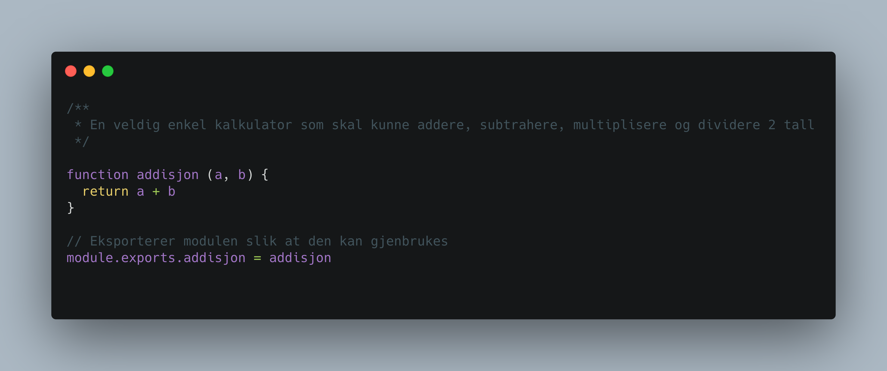

# TDD - Testdrevet utvikling

TDD, test-driven development, er en programmeringsteknikk hvor du skriver testene først og så koden.
I grove trekk består TDD av tre trinn som du gjentar i hele utviklingsløpet.

- Skriv en test som feiler
- Skriv den minste implementasjonen du kan av koden for å få testen til å bestå
- Refaktorer koden

## Et eksempel: en enkel kalkulator

Vi skal lage en kalkulator.
For å starte så enkelt som mulig bestemmer vi oss for at den skal kunne legge sammen 2 tall.
Vi ønsker å ha en funksjon for dette.

Testen sjekker at funksjonen tar imot to tall, 1 og 3. Så sjekker den at resultatet av dette blir 4.

Så skriver vi den minste implementasjonen vi kan komme på for at denne testen skal bestå.

Å skrive en funksjon som bare returnerer 4 får testen til å bestå.
Det kan virke dumt å gjøre noe så lite men nå vet du at denne testen vil passere så lenge funksjonen din returnerer 4 når du sender inn 1 og 3.
Da kan du trygt starte å refaktorere koden din fordi du vet at dersom du gjør det riktig vil testen fortsatt bestå.

Testen består fortsatt og da kan vi, dersom vi ønsker, refaktorere videre.
Det er for eksempel ikke så tydelig å lese koden og forstå hva a og b er.
Vi kan for eksempel erstatte de med tall1 og tall2, eller bruke det helt korrekte addend1 og addend2

